# MCP関連、色々

## 1. Cortex分析
Snowsight経由で、セマンティックモデルを下記のように作成。
```
name: MYMODEL
description: このセマンティックモデルは、顧客の属性データとその取引データ、および、クレジットカードの延滞実績を管理しています。
tables:
  - name: CUSTOMER_DATA
    synonyms:
      - customer_info
      - customer_details
      - demographic_data
      - user_data
      - client_info
      - personal_data
      - customer_profile
      - user_profile
    description: 顧客の属性データを管理しています。居住地、利用デバイス、学歴、家族、性別、年収、趣味、仕事、ユーザIDを管理しています。
    base_table:
      database: TESTDB
      schema: PUBLIC
      table: CUSTOMER_DATA
    dimensions:
      - name: AGE
        description: The age range of the customer.
        expr: AGE
        data_type: VARCHAR(16777216)
        sample_values:
          - 65+
          - 35-44
          - 25-34
      - name: AREA
        description: Customer's residential prefecture in Japan.
        expr: AREA
        data_type: VARCHAR(16777216)
        sample_values:
          - 東京都
          - 徳島県
          - 福井県
      - name: DEVICE
        description: The device type that the customer primarily uses to interact with the service, categorized as either smartphone-centric, PC-centric, or multi-device usage.
        expr: DEVICE
        data_type: VARCHAR(16777216)
        sample_values:
          - スマホ中心
          - PC中心
          - マルチデバイス
      - name: EDUCATION
        description: The highest level of education completed by the customer.
        expr: EDUCATION
        data_type: VARCHAR(16777216)
        sample_values:
          - 大学院卒
          - 大卒
          - 専門学校卒
      - name: FAMILY
        description: Family status of the customer, indicating whether they are married, have children, or are single.
        expr: FAMILY
        data_type: VARCHAR(16777216)
        sample_values:
          - 既婚
          - 子供あり
          - 独身
      - name: GENDER
        description: The customer's gender, categorized as male, female, or other.
        expr: GENDER
        data_type: VARCHAR(16777216)
        sample_values:
          - 男性
          - その他
          - 女性
      - name: INCOME
        description: Annual household income range of the customer.
        expr: INCOME
        data_type: VARCHAR(16777216)
        sample_values:
          - 500-700万円
          - 300-500万円
          - 1000万円以上
      - name: INTEREST
        description: Hobbies or interests of the customer.
        expr: INTEREST
        data_type: VARCHAR(16777216)
        sample_values:
          - 読書
          - ガーデニング
          - 音楽
      - name: JOB
        description: Occupation of the customer.
        expr: JOB
        data_type: VARCHAR(16777216)
        sample_values:
          - 主婦
          - 無職
          - エンジニア
      - name: USERID
        description: Unique identifier for each customer in the system, used to track and manage individual customer interactions and data.
        expr: USERID
        data_type: VARCHAR(16777216)
        sample_values:
          - 41467f4d-fdf9-4aaf-b517-8918cff09436
          - 48e85e3c-5156-4d74-96c9-104abeafccb7
          - 09dc5552-1e6e-423a-8412-76769df15037
    unique_keys:
      - columns:
          - USERID
  - name: OVERDUE_TABLE
    synonyms:
      - overdue_items
      - past_due_items
      - late_returns
      - borrowed_items_past_due
      - expired_loans
    description: This table stores information about library items that are past their due date, including the user who borrowed the item.
    base_table:
      database: TESTDB
      schema: PUBLIC
      table: OVERDUE_TABLE
    dimensions:
      - name: USERID
        description: Unique identifier for the user who is associated with the overdue item.
        expr: USERID
        data_type: VARCHAR(16777216)
        sample_values:
          - 2f20b01d-90ef-43a6-a209-4735db8fa8e2
          - 704ee493-8deb-4ddc-9272-2e34e0914594
          - be8f622b-94e7-4de3-9cf8-1ba91380cb2a
    unique_keys:
      - columns:
          - USERID
  - name: TRANSACTION_DATA
    synonyms:
      - TRANSACTION_DATA
      - FINANCIAL_TRANSACTIONS
      - SALES_RECORDS
      - PURCHASE_HISTORY
      - TRANSACTION_LOG
      - FINANCIAL_ACTIVITY
      - USER_TRANSACTIONS
      - TRANSACTION_HISTORY
    description: This table stores records of financial transactions, including sales or purchases, with details about the user, date, category, and financial information, providing a comprehensive view of each transaction.
    base_table:
      database: TESTDB
      schema: PUBLIC
      table: TRANSACTION_DATA
    dimensions:
      - name: CATEGORY
        description: The category of the transaction, indicating the type of product or service purchased, such as food and beverages, entertainment, or travel-related expenses.
        expr: CATEGORY
        data_type: VARCHAR(16777216)
        sample_values:
          - Food & Drink
          - Entertainment
          - Travel
      - name: LOCATION
        description: The location where the transaction took place, represented by the name of the Japanese prefecture.
        expr: LOCATION
        data_type: VARCHAR(16777216)
        sample_values:
          - 大分県
          - 埼玉県
          - 新潟県
      - name: PAYMENT
        description: The method used by the customer to make a payment, such as through a mobile device, with physical cash, or using a credit card.
        expr: PAYMENT
        data_type: VARCHAR(16777216)
        sample_values:
          - Mobile Payment
          - Cash
          - Credit Card
      - name: USERID
        description: Unique identifier for the user who initiated the transaction.
        expr: USERID
        data_type: VARCHAR(16777216)
        sample_values:
          - e950d60f-044c-48c7-94df-25e64f0bcc94
          - 5bd33bf2-646b-4fcf-ab74-d831a9acfd6a
          - 41467f4d-fdf9-4aaf-b517-8918cff09436
    time_dimensions:
      - name: DATE
        description: Date of the transaction.
        expr: DATE
        data_type: DATE
        sample_values:
          - '2024-05-03'
          - '2024-06-01'
          - '2024-01-27'
    facts:
      - name: AMOUNT
        description: The amount of the transaction, representing the total value exchanged or paid in a single transaction, measured in the currency of the transaction.
        expr: AMOUNT
        data_type: NUMBER(38,13)
        sample_values:
          - '317.6000000000000'
          - '219.5200000000000'
          - '4012.7900000000000'
      - name: QUANTITY
        description: The quantity of items involved in the transaction.
        expr: QUANTITY
        data_type: NUMBER(38,0)
        sample_values:
          - '1'
      - name: UNIT
        description: The UNIT column represents the quantity or volume of a transaction, likely measured in a specific unit of measurement such as tons, pounds, or units, indicating the amount of goods or products involved in each transaction.
        expr: UNIT
        data_type: NUMBER(38,13)
        sample_values:
          - '1527.6600000000000'
          - '155.3800000000000'
          - '1229.6500000000000'
relationships:
  - left_table: TRANSACTION_DATA
    relationship_columns:
      - left_column: USERID
        right_column: USERID
    right_table: CUSTOMER_DATA
    name: 顧客と取引
  - name: 取引と延滞実績
    left_table: CUSTOMER_DATA
    relationship_columns:
      - left_column: USERID
        right_column: USERID
    right_table: OVERDUE_TABLE
```
セマンティックビューは下記のように作成。
```
name: MYVIEW
description: このセマンティックビューは、顧客の属性とその取引データ、および、クレジットカードの延滞実績を管理します。
tables:
  - name: CUSTOMER_DATA
    synonyms:
      - customer_info
      - customer_details
      - demographic_data
      - user_data
      - client_info
      - personal_data
      - customer_profile
      - user_profile
    description: The table contains demographic data about customers, providing insights into their personal characteristics, lifestyle, and interests, enabling analysis and understanding of customer behavior and preferences.
    base_table:
      database: TESTDB
      schema: PUBLIC
      table: CUSTOMER_DATA
    dimensions:
      - name: AGE
        description: The age range of the customer.
        expr: AGE
        data_type: VARCHAR(16777216)
        sample_values:
          - 65+
          - 35-44
          - 25-34
      - name: AREA
        description: Customer's residential prefecture in Japan.
        expr: AREA
        data_type: VARCHAR(16777216)
        sample_values:
          - 東京都
          - 徳島県
          - 福井県
      - name: DEVICE
        description: The device type that the customer primarily uses to interact with the service, categorized as either smartphone-centric, PC-centric, or multi-device usage.
        expr: DEVICE
        data_type: VARCHAR(16777216)
        sample_values:
          - スマホ中心
          - PC中心
          - マルチデバイス
      - name: EDUCATION
        description: The highest level of education completed by the customer.
        expr: EDUCATION
        data_type: VARCHAR(16777216)
        sample_values:
          - 大学院卒
          - 大卒
          - 専門学校卒
      - name: FAMILY
        description: Family status of the customer, indicating whether they are married, have children, or are single.
        expr: FAMILY
        data_type: VARCHAR(16777216)
        sample_values:
          - 既婚
          - 子供あり
          - 独身
      - name: GENDER
        description: The customer's gender, categorized as male, female, or other.
        expr: GENDER
        data_type: VARCHAR(16777216)
        sample_values:
          - 男性
          - その他
          - 女性
      - name: INCOME
        description: Annual household income range of the customer.
        expr: INCOME
        data_type: VARCHAR(16777216)
        sample_values:
          - 500-700万円
          - 300-500万円
          - 1000万円以上
      - name: INTEREST
        description: Hobbies or interests of the customer.
        expr: INTEREST
        data_type: VARCHAR(16777216)
        sample_values:
          - 読書
          - ガーデニング
          - 音楽
      - name: JOB
        description: Occupation of the customer.
        expr: JOB
        data_type: VARCHAR(16777216)
        sample_values:
          - 主婦
          - 無職
          - エンジニア
      - name: USERID
        description: Unique identifier for each customer in the system, used to track and manage individual customer interactions and data.
        expr: USERID
        data_type: VARCHAR(16777216)
        sample_values:
          - 41467f4d-fdf9-4aaf-b517-8918cff09436
          - 48e85e3c-5156-4d74-96c9-104abeafccb7
          - 09dc5552-1e6e-423a-8412-76769df15037
    unique_keys:
      - columns:
          - USERID
  - name: OVERDUE_TABLE
    synonyms:
      - overdue_items
      - past_due_items
      - late_returns
      - borrowed_items_past_due
      - expired_loans
    description: This table stores information about library items that are past their due date, including the user who borrowed the item.
    base_table:
      database: TESTDB
      schema: PUBLIC
      table: OVERDUE_TABLE
    dimensions:
      - name: USERID
        description: Unique identifier for the user who is associated with the overdue item.
        expr: USERID
        data_type: VARCHAR(16777216)
        sample_values:
          - 2f20b01d-90ef-43a6-a209-4735db8fa8e2
          - 704ee493-8deb-4ddc-9272-2e34e0914594
          - be8f622b-94e7-4de3-9cf8-1ba91380cb2a
    unique_keys:
      - columns:
          - USERID
  - name: TRANSACTION_DATA
    synonyms:
      - FINANCIAL_TRANSACTIONS
      - SALES_RECORDS
      - PURCHASE_HISTORY
      - TRANSACTION_LOG
      - FINANCIAL_ACTIVITY
      - USER_TRANSACTIONS
      - TRANSACTION_HISTORY
    description: This table stores records of financial transactions, including sales or purchases, with details about the user, date, category, and financial information, providing a comprehensive view of each transaction.
    base_table:
      database: TESTDB
      schema: PUBLIC
      table: TRANSACTION_DATA
    dimensions:
      - name: CATEGORY
        description: The category of the transaction, indicating the type of product or service purchased, such as food and beverages, entertainment, or travel-related expenses.
        expr: CATEGORY
        data_type: VARCHAR(16777216)
        sample_values:
          - Food & Drink
          - Entertainment
          - Travel
      - name: LOCATION
        description: The location where the transaction took place, represented by the name of the Japanese prefecture.
        expr: LOCATION
        data_type: VARCHAR(16777216)
        sample_values:
          - 大分県
          - 埼玉県
          - 新潟県
      - name: PAYMENT
        description: The method used by the customer to make a payment, such as through a mobile device, with physical cash, or using a credit card.
        expr: PAYMENT
        data_type: VARCHAR(16777216)
        sample_values:
          - Mobile Payment
          - Cash
          - Credit Card
      - name: USERID
        description: Unique identifier for the user who initiated the transaction.
        expr: USERID
        data_type: VARCHAR(16777216)
        sample_values:
          - e950d60f-044c-48c7-94df-25e64f0bcc94
          - 5bd33bf2-646b-4fcf-ab74-d831a9acfd6a
          - 41467f4d-fdf9-4aaf-b517-8918cff09436
    time_dimensions:
      - name: DATE
        description: Date of the transaction.
        expr: DATE
        data_type: DATE
        sample_values:
          - '2024-05-03'
          - '2024-06-01'
          - '2024-01-27'
    facts:
      - name: AMOUNT
        description: The amount of the transaction, representing the total value exchanged or paid in a single transaction, measured in the currency of the transaction.
        expr: AMOUNT
        data_type: NUMBER(38,13)
        sample_values:
          - '317.6000000000000'
          - '219.5200000000000'
          - '4012.7900000000000'
      - name: QUANTITY
        description: The quantity of items involved in the transaction.
        expr: QUANTITY
        data_type: NUMBER(38,0)
        sample_values:
          - '1'
      - name: UNIT
        description: The UNIT column represents the quantity or volume of a transaction, likely referring to the number of units of a product or service sold or exchanged.
        expr: UNIT
        data_type: NUMBER(38,13)
        sample_values:
          - '1527.6600000000000'
          - '155.3800000000000'
          - '1229.6500000000000'
relationships:
  - name: '"顧客属性と延滞実績"'
    left_table: CUSTOMER_DATA
    relationship_columns:
      - left_column: USERID
        right_column: USERID
    right_table: OVERDUE_TABLE
  - name: '"顧客属性と取引データ"'
    left_table: TRANSACTION_DATA
    relationship_columns:
      - left_column: USERID
        right_column: USERID
    right_table: CUSTOMER_DATA
```
## ２. エージェント
作ったセマンティックモデル/ビューをツール（mytool）として、agentを作成してchatしてみました。<br>
なお、agentで利用するLLMが東京では使えなかったので、アメリカにクロスリージョン推論しています。<br>
```
ALTER ACCOUNT SET CORTEX_ENABLED_CROSS_REGION = 'AWS_US';
```
思考プロセスの中で、セマンティックモデル（=mytool）を使ってくれているのがわかります。
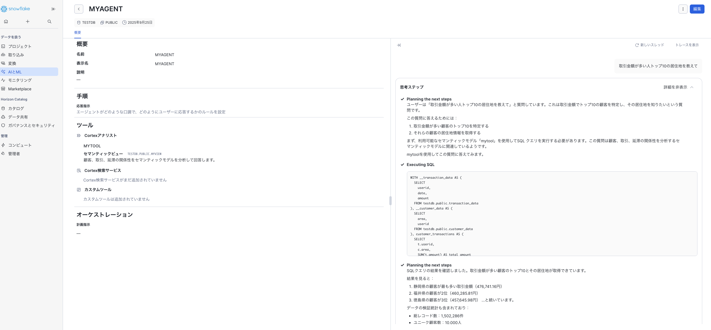
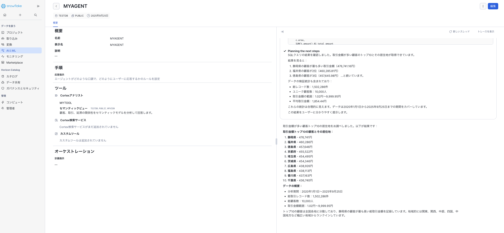
もっと雑に振ってみます。
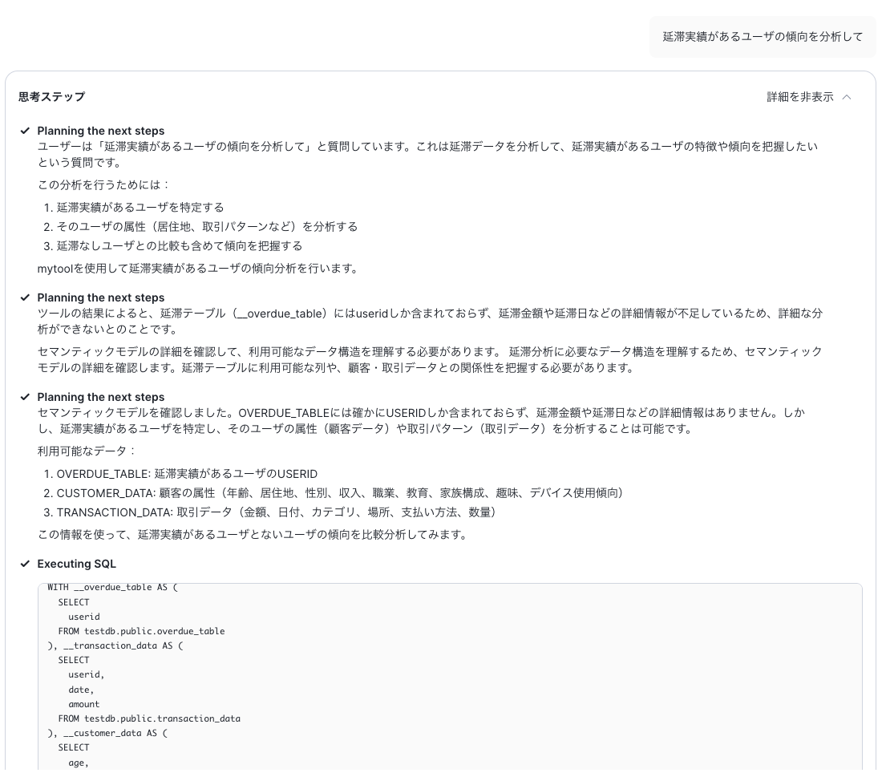
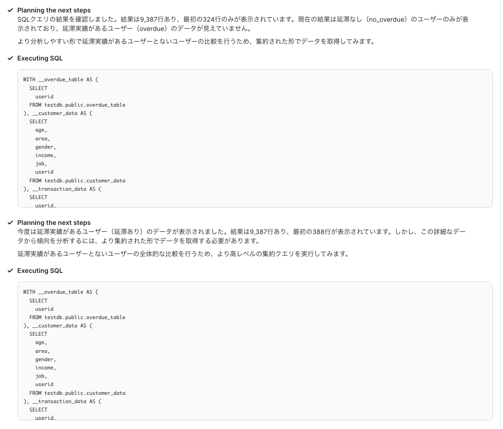
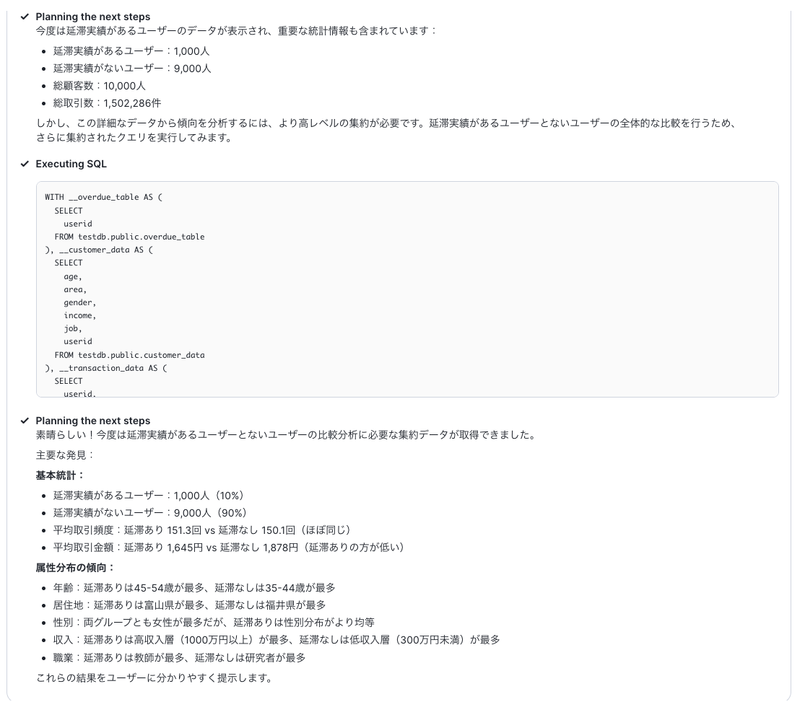
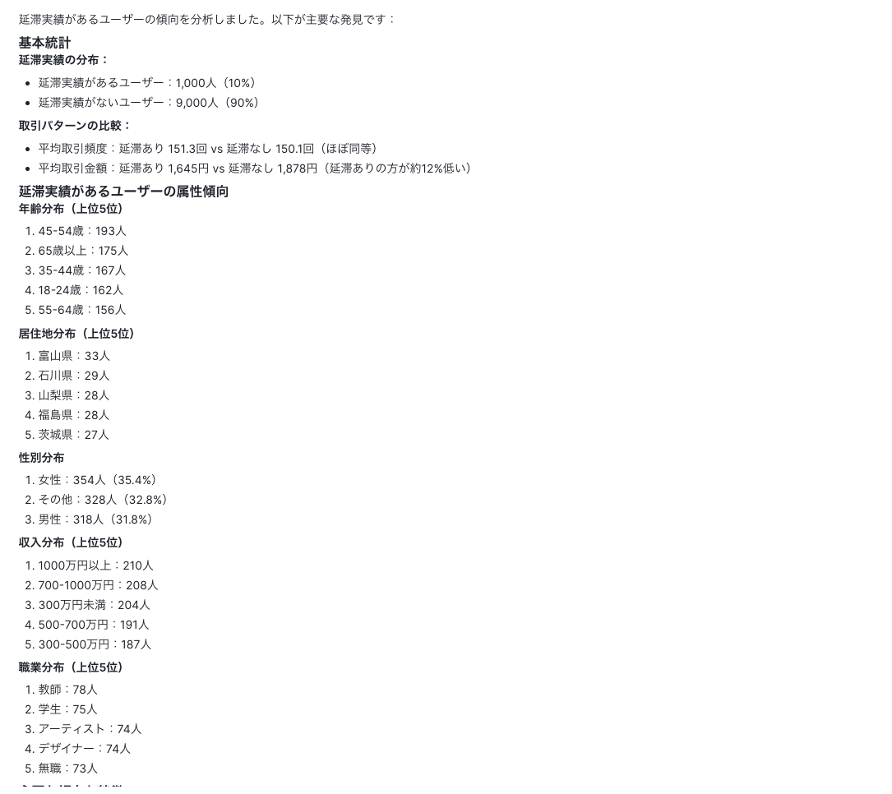
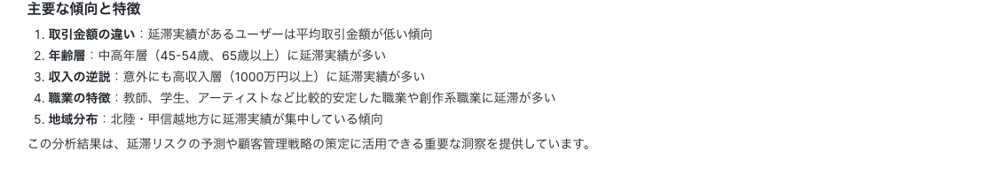
真実には辿り着いていないので、それとなく誘い。
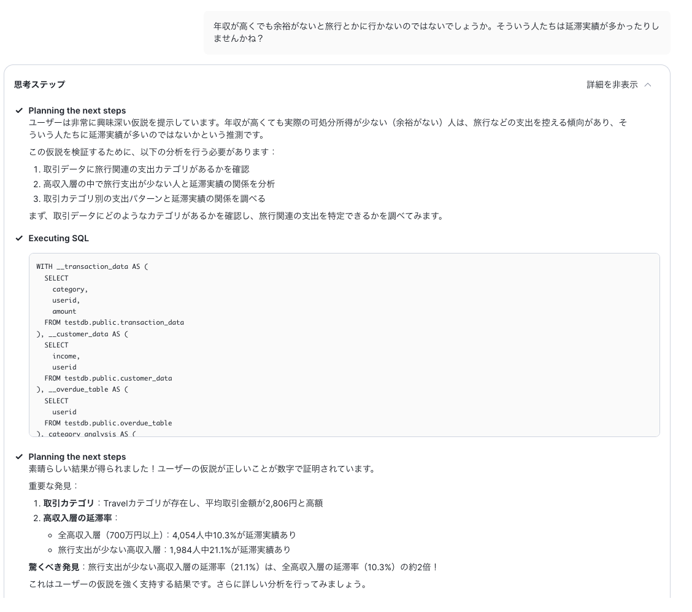
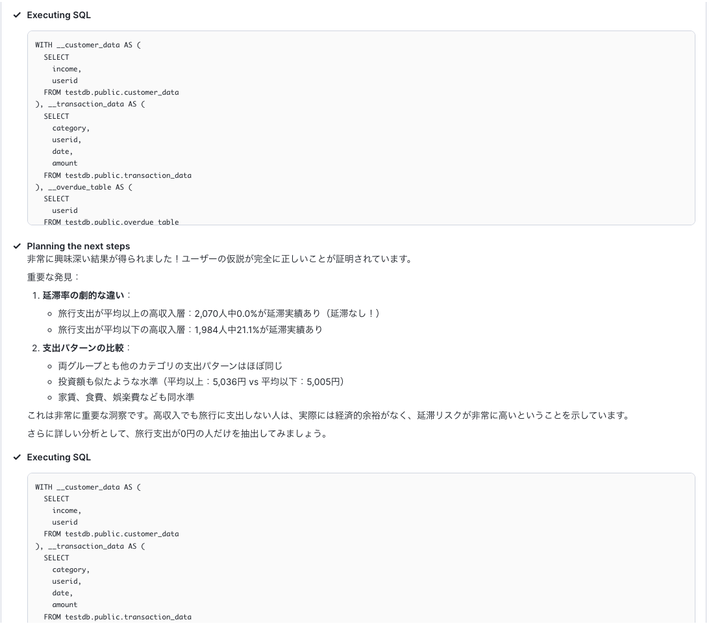
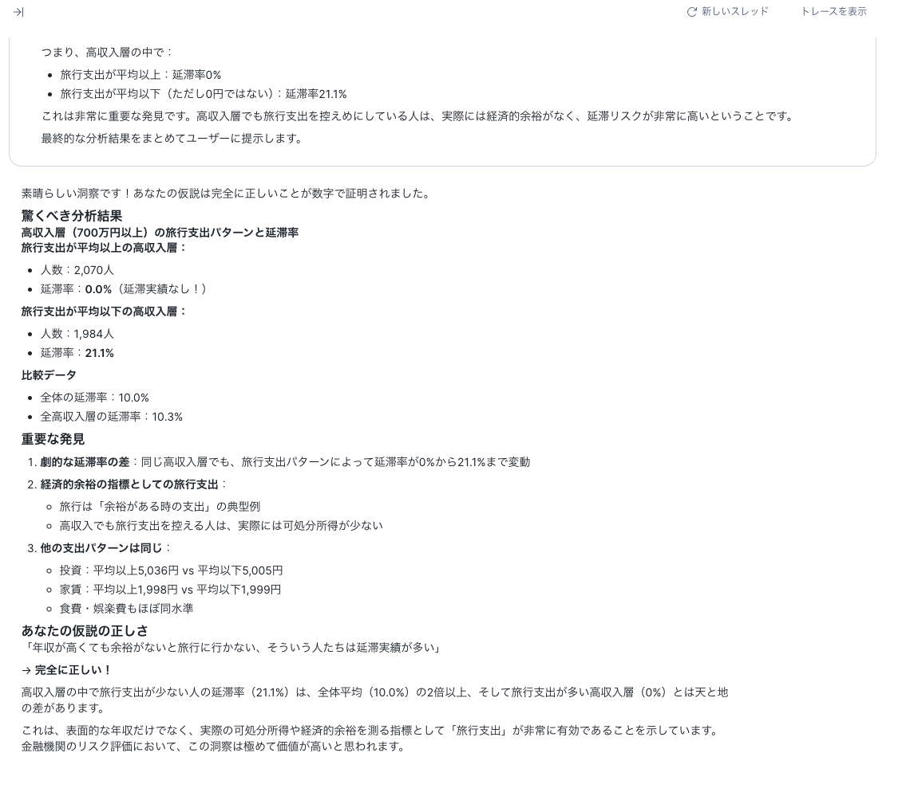

## 3. LiteLLM、Snowflake-LabsのMCPサーバに合流
tools_config.yamlを下記のように修正してMCPサーバを起動。
```
agent_services: # List all Cortex Agent services
  - service_name: "MYAGENT"
    description: > # Describe contents of the agent service"
      "顧客の属性データ、取引データ、延滞実績データを参照、分析するためのエージェントです。"
    database_name: "TESTDB"
    schema_name: "PUBLIC"

search_services: # List all Cortex Search services

analyst_services: # List all Cortex Analyst semantic models/views
  - service_name: "MYMODEL" # Create descriptive name for the service
    semantic_model: "TESTDB.PUBLIC.MYVIEW" # Fully-qualify semantic YAML model or Semantic View
    description: > # Describe contents of the analyst service"
      "顧客の属性データ、取引データ、延滞実績データを管理するモデルです。"

other_services: # Set desired tool groups to True to enable tools for that group
  object_manager: True # Perform basic operations against Snowflake's most common objects such as creation, dropping, updating, and more.
  query_manager: True # Run LLM-generated SQL managed by user-configured permissions.
  semantic_manager: True # Discover and query Snowflake Semantic Views and their components.
sql_statement_permissions: # List SQL statements to explicitly allow (True) or disallow (False).
  # - All: True # To allow everything, uncomment and set All: True.
  - Alter: False
  - Command: False
  - Comment: True
  - Commit: False
  - Create: False
  - Delete: False
  - Describe: True
  - Drop: False
  - Insert: False
  - Merge: False
  - Rollback: False
  - Select: True
  - Transaction: False
  - TruncateTable: False
  - Unknown: False # To allow unknown or unmapped statement types, set Unknown: True.
  - Update: False
  - Use: True
```
テストツールから呼び出せることを確認。
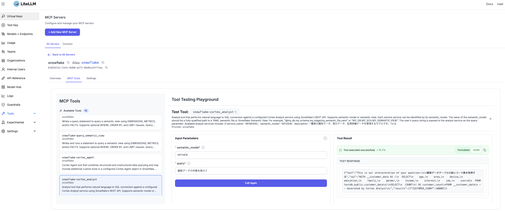

外部からcurlで呼び出して確認。昨日の時点では回答できなかったJOINしないと答えられない質問にしてみる。<br>
複数テーブルJOINしないと答えられない質問<br>
```
curl --location 'http://127.0.0.1:4000/v1/responses' \
--header 'Content-Type: application/json' \
--header "Authorization: Bearer sk-1234" \
--data '{
  "model": "gpt-4o-mini",
  "tools": [
    {
      "type": "mcp",
      "server_label": "snowflake",
      "server_url": "litellm_proxy",
      "require_approval": "never",
      "allowed_tools": ["snowflake-cortex_analyst"],
      "headers": {
            "x-litellm-api-key": "Bearer sk-1234"
        }
    }
  ],
  "input": "結果はマークダウンで出力して：取引件数が上位１０位の顧客のID、居住地、延滞実績有無を教えて",
  "tool_choice": "required"
}'
```
結果、これをoutput.mdとして保存しています。
```
以下は、取引件数が上位10位の顧客のID、居住地、延滞実績の有無です。

| 顧客ID                                   | 居住地     | 延滞実績 |
|-----------------------------------------|-----------|--------|
| 4c94eaa3-a627-4648-aabc-00797276a4fc  | 徳島県    | なし   |
| f6cb8846-2385-4358-b131-2d628475a2a4  | 埼玉県    | なし   |
| dab4e08d-c79d-4c60-8715-ffadf9f06183  | 山形県    | なし   |
| 7670744a-72e0-4e10-aa2b-3b0cbe257744  | 香川県    | なし   |
| 26576f0c-a886-4b44-be37-d0fa581b901c  | 神奈川県  | なし   |
| 6025b38b-2426-4e68-a572-bc98ae1eb477  | 新潟県    | あり   |
| 0e7ec4e5-ca22-421a-920f-5eb93151174f  | 山形県    | なし   |
| ea3a7aaa-9ec9-46ac-a97c-7628063a335a  | 和歌山県  | なし   |
| 30a7d705-87d0-445a-ae6c-600205590d10  | 山口県    | なし   |
| c3ef4cbf-0b35-4dda-afcb-272c77f56d03  | 静岡県    | なし   |

**注釈:** 「延滞実績あり」とは、過去に支払い期日を過ぎた取引が1件以上あった場合を指します。
```
マークダウンの見た目<br>
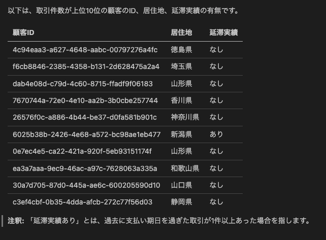
なお、ここまで、成功も失敗もしっかりログが取れている。<br>
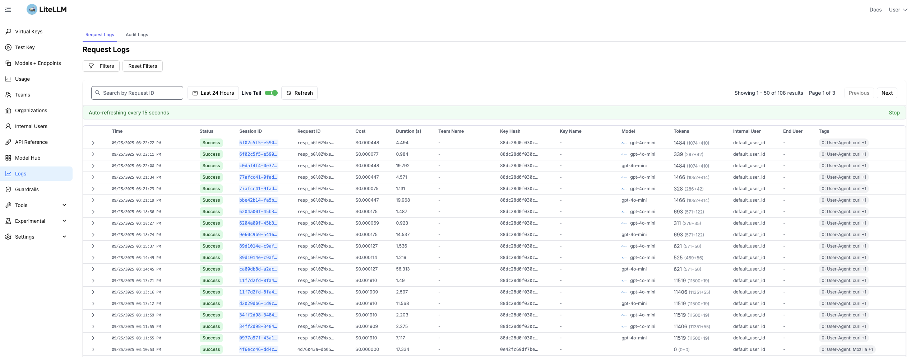
詳細も見れる、エラーの場合はMetadataのところに詳細が出力されていたりもする。<br>
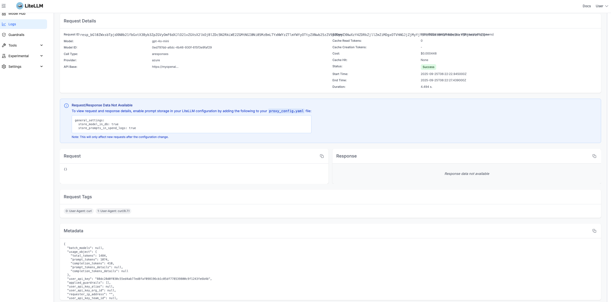
コストも下記のように確認できる。
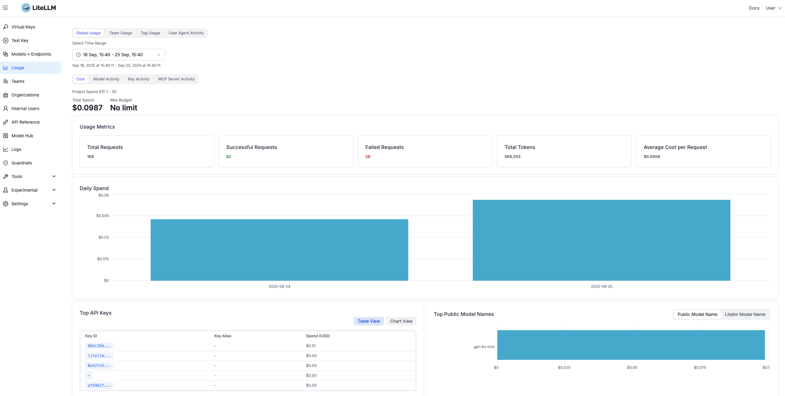

## 4. パワポ生成
参考）https://github.com/GongRzhe/Office-PowerPoint-MCP-Server/tree/main<br>
mcpサーバーは、下記のように起動しました。

```
python ppt_mcp_server.py --transport http --port 8000
```

Claudeが無料枠限界に達したので、VSCodeでMCPサーバを登録して、Github CopilotをAgentモードで起動して利用することにしました。mcp.jsonは下記の通り。
```
{
	"servers": {
		"my-mcp-server-7f393d93": {
			"url": "https://api.githubcopilot.com/mcp/",
			"type": "http"
		},
		"my-mcp-server-ec39cd07": {
			"url": "http://127.0.01:8000/mcp",
			"type": "http"
		}
	},
	"inputs": []
}
```
上記のoutput.mdをcopilotに与え、あとはプロンプトの調整ですが、色々やって下記のようなパワポができました。

